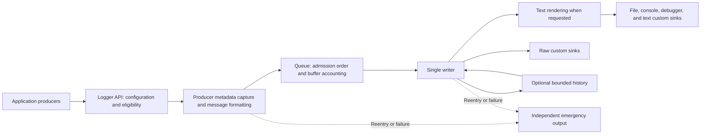

# LLUtils logging

Updated: 2026-10-03. The runtime is implemented in the primary LLUtils submodule. See the verification record below for executed checks and limitations.

This is the authoritative logging design and guide. The [rewrite checklist](logging-rewrite-plan.md)
contains implementation milestones rather than a second specification. The exception foundation owns diagnostic
capture, snapshot subscriptions, C callback lifetime, and terminal-handler installation. Logging reuses it.

- [Architecture](#architecture)
- [Startup defaults and output](#startup-defaults-and-output)
- [Public API and diagnostic features](#public-api-and-diagnostic-features)
- [Usage workflows](#usage-workflows)
- [Runtime, memory, callbacks, and sinks](#runtime-memory-callbacks-and-sinks)
- [History and OIViewer integration](#history-and-oiviewer-integration)
- [Design tradeoffs](#design-tradeoffs)
- [Validation and scope](#validation-and-scope)

## Design goals

LLUtils logging adds no dependency. It is header-only using `static inline` class members, registered category handles, a central mutex-protected queue, and one writer thread.

LLUtils owns the runtime. OIViewer explicitly initializes it before application components and shuts it down after producers stop.

**Do not implement a logging-health monitoring subsystem.** Exclude public queue statistics, high-water marks, producer-wait measurements, oldest-record age, health-query APIs, last-error/last-flush queries, flush deadlines, and automatic throttling of emergency notices. Do not leave these as pending work for this refactor.

Keep only:

- Private bookkeeping needed for capacity, lifetime, and failure handling.
- Direct operation results and best-effort emergency diagnostics.
- Counts required by explicitly selected repetition controls and history retention.
- Measurements performed by development tests and benchmarks.

## Architecture



The producer owns the message before admission. The writer owns normal sink delivery and moves retained record data into history after live processing. History replay uses its startup-fixed format. Configuration is selected before formatting; sequence numbers are assigned when records enter the queue.

## Startup defaults and output

The defaults below are runtime settings, not benchmark-derived memory, throughput, or latency guarantees. `LoggerOptions` starts with no sinks; OIViewer explicitly supplies the file, console, and development debugger destinations shown below. Preserve the full-message, best-effort retention, and durability boundaries when explaining these defaults.

Defaults:

| Setting | Default |
|---|---|
| Global live minimum level | `Info` |
| Queue capacity | 8,192 records |
| Admitted normal-message buffer budget | 16 MiB |
| Exhausted capacity | Wait at admission |
| Oversized messages | Above the byte budget: preserve fully; one admitted at a time |
| Periodic flush | One second after the first pending write; no periodic wakeups while clean |
| Flush severity | `Error` and above |
| File rotation / retention | 10 MiB / five closed files (best-effort retention target) |
| File threshold | All category-enabled levels |
| Console threshold | `Warning` |
| Debugger output | Development builds |
| Timestamp display | UTC, milliseconds |
| Diagnostic history | Disabled |
| Enabled history limits | 128 records and 1 MiB |
| History capture minimum level | `Debug` |
| History text format | Startup default text-format configuration, fixed for the session |
| History dumping | Before emitted Error/Critical records and on manual request |

Default pattern:

```text
[{date}][{time}][{loglevel}]{message}
```

Example output:

```text
[2026-09-14][14:25:31.127][Info]Image loaded
```

## Public API and diagnostic features

**Core API and categories**

- Use static `LLUtils::Logger` operations for initialization, shutdown, flushing, registration/lookup, logging, filtering, and text-format configuration.
- Use `static inline` class members, avoiding namespace-scope `static` variables that create separate instances per translation unit.
- Registration owns a case-sensitive category name and returns an opaque, copyable handle. Duplicate names reuse one identity. Registration is thread-safe; handles survive logging shutdown/reinitialization. Categories are not removed.
- Components may retain separate handle copies and share name constants through their common owning module.
- Provide a preformatted-message API and `LL_LOG(category, level, format, ...)` for checked formatting. Evaluate category and level once; skip message arguments when no eligible consumer needs them.
- Support `Trace`, `Debug`, `Info`, `Warning`, `Error`, and `Critical`. `Off` disables categories/destinations and is not an emitted severity.
- Category overrides replace the default live threshold; sink thresholds apply additionally. Explicit category `Off` disables both live output and history capture. Default live `Off` leaves independently enabled history available.
- Runtime setters change filtering and default/per-sink live text formats. Live formatting remains fully configurable; these setters do not change the fixed history text format or its capture requirements. Sink topology, storage locations, queue/memory limits, flush policy, and history settings remain startup configuration.

| Interface | Behavior |
|---|---|
| `Initialize(LoggerOptions)` / `Shutdown()` | Create/close the one session; return `LogResult` |
| `RegisterCategory(name)` / `FindCategory(name)` | Own/reuse a case-sensitive name; return `LogCategory` |
| `Log(category, level, messageOrFactory, source)` | Copy existing UTF-8 text or lazily invoke a factory only when eligible |
| `LL_LOG`, `LL_LOG_EVERY_N`, `LL_LOG_EVERY_N_SEC` | Checked lazy formatting; repetition controls share per-site state |
| `SetGlobalMinimumLevel`, `SetCategoryMinimumLevel`, `SetSinkMinimumLevel` | Publish live filtering; `nullopt` removes a category override |
| `SetFormat(format, optionalSinkIndex)` | Publish a validated default/per-sink layout; preserve configuration on failure |
| `Flush()` / `DumpHistory(source)` | Ordered completion barrier / ordered asynchronous replay request |
| `OperationId::Create()` / `OperationScope` | Allocate request identity / restore synchronous thread-local context |
| `LogSink::Write(LogDelivery)` / `Flush()` | Writer-only callbacks; borrowed record/text views; false/throw disables a sink |
| `NeedsText()` / `RequiredFields()` | Fixed sink declarations read at initialization |
| `Logger::Emergency(text)` | Bounded independent native output with no queue or callbacks |

`LogResult` distinguishes success, inactive/skipped calls, invalid configuration, output failure, and rejected
reentry. Sink constructors can throw on invalid paths/open failure; catch these at the startup boundary. Text sinks
append terminators. Raw sinks own any data retained after `Write` returns.

**Configurable output**

Support:

```text
{date} {time} {module} {loglevel} {message}
{threadid} {file} {line} {function} {operationid} {sequence}
```

- `{module}` means the registered category. An absent operation ID renders as `-`.
- Square brackets, spaces, and surrounding text are literal. `{{` and `}}` emit literal braces. No brackets or separators are inserted automatically.
- Date/time fields accept chrono format specifications, such as `{date:%Y-%m-%d}` and `{time:%H:%M}`. Defaults are `%Y-%m-%d` and `%H:%M:%S`.
- `LogTextFormat::timestampPrecision` uses `LogTimestampPrecision` for display only. Text-format configuration selects UTC or local time (the local zone is cached with the compiled format) and fractional precision: seconds, milliseconds, microseconds, or nanoseconds. Display precision does not imply clock accuracy.
- Non-date/time metadata supports fixed-width fill/alignment, such as `{loglevel:<8}`. Reject widths above 1,024, dynamic nested widths, and truncation specifications.
- Parse and validate patterns before publication. Failed updates preserve the working configuration. Insert message contents as data, never as another pattern.
- Text sinks add record terminators. Preserve multiline content and normalize file output to UTF-8/CRLF.

**Operation correlation**

- Use a lightweight `OperationId`, allocated once per logical request using a process-wide monotonic identifier.
- Provide a noncopyable/nonmovable `OperationScope` that installs thread-local context and restores the previous value on exit, including exception unwinding.
- Explicitly propagate IDs through asynchronous requests, task entries, and completion data. Establish short synchronous scopes when execution begins or resumes.
- Never retain an operation scope across `co_await`; retain the ID as ordinary coroutine-frame data and re-establish context after resumption.
- Integrate IDs into image-open, decode/residency, cancellation, and completion/presentation flows. Preserve existing cancellation generations and versions.
- Shared decode work retains its original identity; additional requests record their association with it.
- Exception reporting preserves original operation and source context. General typed message attributes and span hierarchies are not introduced.

**Sequence numbers**

- Assign admitted data records a monotonically increasing session sequence under the queue mutex. Filtered or rate-suppressed calls receive none.
- Keep actual producer timestamps and enqueue order. Rendering `{sequence}` is optional.
- Preserve original sequences during history replay. Flush/history control requests do not consume data-record sequence numbers.
- Generated history markers have no admission sequence and render `{sequence}` as `-`.

**Explicit repetition controls**

- Use `LL_LOG_EVERY_N` and `LL_LOG_EVERY_N_SEC` with fixed positive count/period per call site.
- State is shared across threads at that call site and resets per logging session; it is not keyed by category, operation, or message contents.
- Count-based limiting emits calls `1`, `1 + N`, `1 + 2N`, and so on. Time-based limiting emits immediately, then at most once per interval using `steady_clock`.
- Apply live/history eligibility first, then repetition control. Suppressed calls are not formatted or retained in history.
- Hold the limiter’s bookkeeping guard only for state updates.
- Attach the suppressed count to the next emitted record and append ` (skipped N calls at this site)` to its message when nonzero. Keep the count as numeric record metadata.
- Quiet sites do not generate automatic shutdown summaries.
- Document that these helpers aggregate across operations and are unsuitable for events that must be recorded once per request.

## Usage workflows

The public interface is declared in `LLUtils/Logging/Logger.h`. The workflows below use its implemented C++ interfaces.

**Initialize and shut down**

```cpp
LLUtils::LoggerOptions options;
options.sinks.push_back({std::make_shared<LLUtils::FileLogSink>(
    LLUtils::LogFileOptions{.path = "logs/viewer"})});
options.sinks.push_back({std::make_shared<LLUtils::ConsoleLogSink>(),
                         LLUtils::LogLevel::Warning});
if (LLUtils::Logger::Initialize(std::move(options)) != LLUtils::LogResult::Success)
    return;
const auto images = LLUtils::Logger::RegisterCategory("ImageLoader");
LL_LOG(images, LLUtils::LogLevel::Info, "Image loaded: {}", "photo.jpg");
// Stop all application producers before shutdown. Logging remains available during component teardown.
LLUtils::Logger::Shutdown();
```

**Share a category and change live output**

Register a stable name such as `ImageLoader` and share copies of its handle between components. Log through the handle using the `LL_LOG(category, level, format, ...)` macro or preformatted-message API. Change live filtering and patterns through the runtime setters; each in-progress call retains its previously selected configuration.

For example, the pattern `[{date}][{time}][{module}][{loglevel}]{message}` includes literal brackets and a category name. Sink topology and storage settings change through session reinitialization.

**Correlate asynchronous work**

Create one operation ID for an image request and carry it in request, task, and callback context. Enter a short operation scope when each piece of work executes and restore the prior scope afterward. Keep the ID in a coroutine frame across suspension and re-establish a scope after resumption. Include `{operationid}` in a consuming format when the identifier should be captured and displayed.

**Limit a repetitive warning**

Use the `LL_LOG_EVERY_N` helper at the particular call site that needs suppression. With a count of 100, eligible calls 1, 101, 201, and so on emit; subsequent emitted messages report the suppressed count. `LL_LOG_EVERY_N_SEC` provides the time-based alternative. Suppressed messages enter neither live output nor history.

**Enable diagnostic history**

Enable history in startup configuration. With live level `Info` and history minimum `Debug`, eligible Debug records can be retained without normal live output. A later live Error/Critical record dumps preceding history before its own output, or the application can request `DumpHistory()` and then `Flush()` to wait for completion. Replay is marked, may repeat previously visible records, and uses the startup-fixed history format.

```cpp
const auto operation = LLUtils::OperationId::Create();
{
    const LLUtils::OperationScope scope(operation);
    LL_LOG_EVERY_N(images, LLUtils::LogLevel::Warning, 100, "Decoder retried {} times", 2);
}
LLUtils::Logger::SetFormat({.pattern = "[{module}][{operationid}][{sequence}]{message}"});
LLUtils::Logger::SetCategoryMinimumLevel(images, LLUtils::LogLevel::Debug);
LLUtils::Logger::DumpHistory(); // Enable options.history.enabled before Initialize.
LLUtils::Logger::Flush();       // Wait for preceding admitted records and the dump.
```

Pass operation IDs as request data across asynchronous boundaries. Establish scopes before submission and after
resumption. A scope must never span `co_await`.

## Runtime, memory, callbacks, and sinks

**Ownership and lifecycle**

| Owner | State and responsibility |
|---|---|
| Producer | One captured configuration, requested metadata, and the fully owned formatted message before admission |
| Queue envelope | Record, captured live configuration, cached admission charge, oversized flag, and optional control completion |
| Session | Immutable startup policy, fixed sink declarations, configuration publication, admission synchronization, and worker lifetime |
| Writer | Sink calls and failures, pending output/deadline, rendering scratch, rotation, and history |
| History | Owned record data and independent retention accounting; no live configuration or queue accounting |

Initialization validates startup settings and publishes one accepting session. Reinitialization while a session exists
is rejected. Shutdown closes admission, wakes waiters, disconnects future exception snapshots, waits for active
producer preparations to finish, drains accepted commands/records, flushes, joins, and releases sinks. Concurrent
initialize/shutdown calls serialize; repeated shutdown returns `Inactive`. A previously selected exception callback
retains the old disabled session and cannot enter a replacement session. Ordinary logging macros skip inactive sessions
before evaluating arguments; `Logger::Emergency` remains available through process exit.

Flush barriers and manual dumps share ring slots with data records, carry no message-budget charge, and receive no
data sequence. A full queue makes their callers wait for a slot; shutdown wakes commands that were not admitted and
returns `Inactive`. Admitted barriers always receive completion, including during draining. Manual dumps return after
admission; a following `Flush()` observes delivery failures. A session output failure remains reflected by subsequent
flush/shutdown results. Writer/formatting reentry rejects control calls that would wait on themselves.

`Logger::Log` has an existing-text overload and a constrained lazy-factory overload returning an owned string.
The lazy overload captures one configuration, checks eligibility and repetition, registers the active producer,
captures required metadata, invokes the factory at most once, and admits the owned record. Its local registration
is released on every exit. No preparation token escapes to a caller. Exception observers use the same internal
operation with their captured session and original diagnostic context. Success means queue admission; `Flush()`
provides completion. Use `LL_LOG` or a factory to skip expensive message construction.

**Admission and metadata**

- Prepare immutable delivery plans combining live/history eligibility, live compiled formats, and required record fields. Each call selects one plan before checking eligibility, capturing metadata, or formatting.
- Runtime updates affect calls selecting a plan after publication. Retain the selected plan through initial processing; in-progress calls keep its filtering, field requirements, and live formats even if admitted after an update. Queue admission does not select a new configuration; sequence numbers still reflect admission order.
- Capture a producer timestamp once when date/time is requested, before formatting or admission waits. Capture thread ID, operation context, and source details only when required.
- When history is enabled, compute its fixed capture requirements at startup: fields used by the startup default text format when text sinks exist, plus the declared requirements of configured raw-record sinks. Later live format changes do not change this mask.
- Capture the union of eligible live consumers’ requirements and the fixed history requirements when the record is eligible for history. Retained history contains record data only, without references to the originating live delivery plan or per-sink formatter versions.
- Own all deferred message data; never enqueue borrowed formatting arguments or caller string views.

**Queue and memory**

- Use one ring queue, queue mutex, condition variables, and writer. Keep formatting, sink operations, callbacks, and joins outside queue/configuration/registry locks.
- Format or copy a requested message once into an ordinary owned string before admission. Determine its storage charge from the completed owned buffer; do not introduce producer workspace reservations, allocation-growth tracking, a custom budget-aware formatter, or mid-format promotion.
- Enforce the queue’s record capacity and the admitted normal-message byte budget separately. Charge owned message-buffer capacity at admission and retain that charge while the record is queued or being processed by the writer. Release it only when initial processing completes, not merely when the record is dequeued.
- Keep record data (owned message and captured metadata) separate from the private data command (record data, selected live plan, cached admission charge, and oversized state). Cache the charge independently of the string so releasing it never depends on a moved-from buffer.
- A normal record’s charge must fit within the remaining normal-message budget before it is admitted. Validate positive record and byte limits during initialization; use overflow-safe capacity comparisons.
- A record whose charge exceeds the entire normal-message byte budget is oversized. Admit it without truncation when a queue slot is available and no other oversized record is admitted. Keep an oversized-active flag until its initial processing completes; exclude its charge from the normal-message budget.
- Normal records may continue to use their own budget while an oversized record is admitted. Oversized admission must not require the normal queue or byte budget to become empty. Use the same queue mutex and admission condition variables, without a separate pre-format permit protocol.
- Producers wait at admission while retaining their fully formatted strings. Those unadmitted strings, including multiple oversized strings waiting concurrently, are explicitly outside the byte budget. This weaker guarantee is the chosen simplicity tradeoff.
- The byte budget covers admitted normal-message buffers only. It is not a hard process-memory cap; oversized records, unadmitted producer strings, application arguments, registry/configuration storage, custom-sink allocations, independent history storage, and writer rendering scratch space can increase total memory use.
- The writer never waits for normal queue admission or byte-budget availability. Its rendering scratch space is separate.
- Shutdown stops admissions, wakes waiting producers, keeps session resources alive until active emitters finish safely, drains accepted records, flushes, and joins the worker. Release admission charges and oversized state on every completion/failure path.
- `Flush()` enqueues an ordered barrier and waits for preceding admitted records to finish processing and sink flushing to complete; return output failures. Records not yet admitted when the barrier is enqueued, including calls still formatting or waiting for capacity, are outside its guarantee. Ordinary error calls do not wait for severity-triggered flushing.
- Gate periodic flushing on writer-owned pending-output state. The first successful sink write after a flush arms a `steady_clock` deadline one configured interval later. Further writes do not postpone it. Live records, history replay, and markers can arm it; filtered calls and history-only capture cannot.
- If the queue is empty but a sink still has pending output, wait for a queue event or that deadline. If no enabled sink has pending output, wait for queue/shutdown events without a periodic timeout. Check the deadline between processed records under continuous traffic.
- Periodic flushing visits pending sinks only. Explicit barriers and shutdown flush all enabled sinks; emitted Error/Critical records trigger flushing according to startup severity. Successful flushes and sink disabling clear pending state. When no pending sinks remain, disarm the deadline. No separate timer thread or public flush-health state is needed.

**Callbacks and lifetime**

- Reuse Exception::OnException.Subscribe and its exception-specific snapshot dispatcher; do not synchronize the generic Event or add a second exception channel. Snapshot shared callback entries under the registry mutex and invoke outside it.
- Disconnect removes a subscription from future snapshots without waiting; an already selected callback may still run. This is the exception dispatcher's snapshot contract; disconnection does not wait for an already selected callback.
- The logger observer captures shared session/admission state, not a raw application or logger pointer. Shutdown disables that state, wakes waiting admissions, and waits for active emitters before releasing sinks. An old observer snapshot sees inactive state and cannot access released session resources.
- Preserve the OIV bridge's shared callback state and synchronized invocation/replacement/disable rules. Shutdown or replacement must not return while another thread can still use the old user pointer. Copying function/user-data together is insufficient; same-thread callback reentry and its remaining target lifetime follow the exception plan. Never hold the global exception-registry or logger queue/configuration locks across application code.
- Keep any callback-state serialization local to that consumer. Do not introduce a public waiting subscription API or require a logger callback to wait on itself. Sinks cannot wait for application locks/threads that may be logging.
- Sinks must not synchronously wait for application threads or acquire application-owned locks that producers might hold while logging. GUI sinks post owned updates asynchronously.
- Detect writer and frontend-formatting reentry. Emergency output uses bounded already-available text or a fixed literal, without user formatting, sink callbacks, normal exception dispatch, or queue admission.
- Logging macros check reentry before evaluating nested message arguments, so recursive argument expressions are skipped. Direct preformatted calls can use their existing text; ordinary C++ argument evaluation occurs before entering that API.
- Handle logging-originated LLUtils exceptions before normal exception dispatch, using the shared thread-local reentry state and independent native emergency output. Reject worker flush/shutdown requests that would wait on the worker itself.
- Use constant-initialized, trivially destructible admission state to recognize inactive logging before touching potentially destroyed runtime objects. Late fallback must not dereference expired registry/category/sink state.

**Sinks and failures**

- Each sink declares required record fields and whether it requires formatted text.
- Built-in file, console, and debugger sinks request text. Custom sinks may consume records only.
- Supply an immutable record view and optional rendered text, valid for the call’s duration. Raw-only sinks do not inherit patterns or cause rendering.
- Render only when requested and reuse text for identical formats where practical.
- Keep files open and check write/flush results. Retention selects only numeric PID/session/segment filenames; emergency and legacy files are preserved. Use UTF-8 file output and native filesystem paths; isolate console/debugger platform conversion within those sinks.
- Create private log and emergency files with non-inheritable Windows handles or POSIX close-on-exec descriptors. The first configured emergency file remains open for the process lifetime, including after normal shutdown; subsequent sessions reuse it. Set these flags during creation to avoid concurrent child-launch races, including on rotation/reopen. Preserve the application’s intentional stdout/stderr inheritance.
- Use unique session/PID filenames, rotate without splitting records, coordinate retention across processes, and skip active files.
- Treat retention cleanup separately from record output. If enumerating or deleting old closed files fails, continue writing and rotating while output operations succeed. Report the cleanup failure through independent emergency output and attempt cleanup again at the next normal rotation, without a separate retry timer or worker.
- Retention is a best-effort target, not a strict disk-usage limit. Persistent cleanup failures can let closed-file count and disk usage keep growing. Document this choice in the file-sink retention configuration/API comments and beside cleanup-error handling, as well as in this guide.
- Return initialization/configuration/flush errors directly where applicable. Use independent emergency output for asynchronous failures.
- A retention-cleanup failure alone does not disable a writable file sink. Other sink failures, including actual write or flush failures, disable that sink for the session while healthy destinations continue. Keep only the private state needed for this behavior—no health-query API or diagnostic statistics subsystem.
- Do not add time-based throttling or aggregate failure counters for emergency notices. Reentry guards remain necessary to prevent recursion.
- Queue saturation does not deliberately discard admitted records. Allocation/output failures and crashes remain best-effort conditions.

## History and OIViewer integration

**Opt-in diagnostic history**

- Configure history only at startup, disabled by default. Provide `DumpHistory()` and automatic dumping before live Error/Critical output.
- Use one global ring, bounded by both record count and bytes. History has its own minimum level and can capture records hidden by live verbosity; explicit category `Off` disables it.
- Compile one history text format from the complete startup default text-format configuration, including pattern, timezone selection, precision, and alignment. All text destinations use this format for history replay and its marker lines. No separate history-format setting is introduced.
- Keep that format and its capture requirements fixed for the logging session. Per-sink live overrides and later default/per-sink format changes do not affect history. Runtime live formatting remains unchanged.
- Retain original record data in queue order, without live routing plans or per-record/per-sink format snapshots. Own the fixed history formatter once at session level rather than through each retained entry.
- Give history independent ownership and byte accounting. After live processing, move only owned record data into history. Release the cached admission charge and oversized-active state from the data command exactly once when initial processing completes, including failure paths. History must not retain that envelope, its live plan, or its admission bookkeeping.
- Evict oldest entries to meet history limits. Omit an entry that cannot fit the history byte limit and count that omission. Normal live delivery remains complete.
- Dump preceding history to an error trigger’s selected destinations. Manual dumping is an ordered command to enabled destinations. A following `Flush()` waits for it.
- Replay bypasses stored records’ normal severity filters for the selected dump destinations.
- Preserve captured timestamps, sequence numbers, operation IDs, and other available record fields. Render history text with the fixed startup format; raw-record sinks receive the original data without mandatory text rendering. Mark replay through sink-delivery metadata and begin/end lines.
- Marker lines identify evictions/omissions and use trigger/manual-request context, rendered with the same fixed history format. They are control output.
- Previously emitted records may appear again within marked history. A complete dump accepted through its end marker by at least one destination consumes history globally and resets eviction/omission counts. If none completes, retain history. Failed sinks are disabled; there is no per-destination retry cursor or replay retry queue.
- Emergency/internal logger failures do not trigger history dumps.
- Document the deliberate tradeoff: history preserves event data but does not reproduce changing per-sink layouts or adopt later live-format changes. This avoids retaining historical formatting/routing configurations and keeps history capture and replay simpler.

**OIViewer integration**

- Initialize logging after command-line early exits/file forwarding and before platform/viewer initialization. Use scoped cleanup so logging remains available through exception handling and teardown.
- Categories cover startup, renderer, settings, image-open/residency, and LLUtils exception diagnostics. Emit a session header with version, revision, platform, and rendering options; record renderer/GPU selection through the logger.
- Propagate operation IDs through the current image-loading/residency contexts, coroutine resumptions, and batched completion callbacks. Capture IDs as data, restore scope after resumption, and preserve cancellation, stale-result rejection, failed posting, and fatal task discard. Do not keep an OperationScope across co_await.
- OIViewer uses the runtime instead of ApplicationLog and legacy singleton calls, preserving the exception work's safe sink ownership and formatting. Migrate diagnostic cerr/clog calls while preserving intentional command-line output and exit behavior; do not recreate the removed raw-sink registration.
- Install one automatic exception-to-logger subscription using the existing exception dispatcher. Replace the viewer's direct file observer, preserve independently requested OIV client callbacks and the lazy bridge, and avoid enabling that bridge solely for viewer logging.
- Disconnect before teardown and make previously selected snapshots harmless through shared disabled session state; leave unrelated generic events unchanged.
- Reuse the exception foundation's descriptive what(), error labels, bounded formatter, and 64-frame capture. Add operation context at the existing capture boundary without recapturing stacks or emitting duplicate normal exception events.
- Reuse the platform exception registration/reporting owner; do not install a competing unhandled filter or terminate handler. Integrate a preopened emergency destination using fixed storage/native output, with lifetime-safe fallback before logger initialization and after shutdown. Preserve handler restoration, the at-most-one Windows UI attempt, and normal OS fault processing from the exception plan; native faults never enter the ordinary logger queue.

## Design tradeoffs

The following decisions retain the agreed capabilities and make their rationale and accepted limitations explicit. Included features can add complexity when they serve a selected diagnostic use case. Excluded capabilities are outside this refactor, not unfinished implementation work. Only the measurement-gated alternatives in D34 are identified for possible reconsideration.

**Ownership, public API, and configuration**

| Decision | Reason / benefit | Accepted cost / capability boundary |
|---|---|---|
| **D01 — Retain LLUtils backends without adding a logging-library dependency** | Preserve the existing integration and avoid another package, adapter layer, and dependency lifecycle. | LLUtils must maintain and validate queueing, formatting, rotation, and failure handling. Fewer dependencies do not establish lower total implementation or maintenance cost. |
| **D02 — Keep header-only state in `static inline` class members; exclude cross-DLL runtime sharing** | Share state across translation units without a separately linked logging runtime or exported runtime bridge. | Consumer builds compile the headers. One shared runtime across separately loaded libraries is not guaranteed; a supported cross-DLL bridge would require a separate design. |
| **D03 — Keep one LLUtils-owned runtime with explicit application initialization and shutdown** | Provide convenient global access while making startup and teardown ordering explicit. | Shared global ownership remains. Independent logger instances are unavailable; tests and hosts must coordinate session configuration and lifetime. The application must stop producers before shutdown, and late logging has only the safe fallback. |
| **D04 — Use registered, case-sensitive category handles with permanent identities** | Avoid repeated name lookup at call sites and handle invalidation/removal protocols; shared names resolve to one identity. | Registration and the shared registry need synchronization. Category names consume storage for the process lifetime, and differently spelled or cased registrations are distinct. Categories should describe stable components, not individual requests. |
| **D05 — Keep live category/sink filtering and compiled formats in one captured configuration** | Allow runtime diagnostic changes while keeping eligibility, captured fields, and formatting consistent for each call. | Filtering and pattern configuration add API and validation work. In-progress calls can use an older configuration after an update returns. Snapshot acquisition has a cost; `atomic<shared_ptr>` is not guaranteed lock-free. |
| **D06 — Configure sink topology, storage, capacities, flush policy, and history at startup** | Avoid replacing active resources and coordinating their retirement while records are in flight. | These changes require session reinitialization with the normal producer/lifetime rules. Live level and text-format updates remain available. |
| **D07 — Keep application logging controls API-only; exclude GUI/settings-file integration** | Avoid adding persistence, settings precedence, GUI wiring, and another configuration lifecycle. | The application must expose controls through code; users cannot configure logging through the existing viewer settings. Additional logging-control interfaces are outside this version. |

**Delivery, ordering, and memory**

| Decision | Reason / benefit | Accepted cost / capability boundary |
|---|---|---|
| **D08 — Use one central mutex queue and one writer** | Give admitted records one order and concentrate sink access, periodic work, and resource ownership in one worker. | Queue contention and single-writer throughput can limit performance. A slow sink delays later sink calls and queued records; once capacity fills, producers also wait. There is no independent worker per sink. |
| **D09 — Format messages on producers into owned strings** | Avoid deferred argument serialization, borrowed-object lifetimes, and executing arbitrary argument formatters on the writer. | Producers pay formatting/allocation costs before admission. Blocked producers retain their completed strings outside the admitted-message budget. The writer still performs configured record-to-text rendering. |
| **D10 — Wait for queue capacity rather than discard records because of saturation** | Preserve admitted diagnostic records and use one overflow policy. | Logging can delay application work, including image loading. Sinks and callbacks must obey the lock/wait rules to avoid circular waits. Shutdown can stop pending admissions; allocation/output failures and crashes still limit delivery. |
| **D11 — Account for normal-message storage only from admission through initial processing** | Use completed buffer capacities and one admission decision, without workspace reservations, allocator tracking, or mid-format promotion. | The byte budget bounds admitted normal-message buffers only. Producer strings, oversized records, metadata/configuration, history, custom sinks, and rendering scratch can raise total memory use above it. |
| **D12 — Preserve oversized messages and admit at most one at a time** | Retain complete diagnostics with one oversized-active flag instead of truncation, rejection, or a second reservation protocol. | The admitted oversized buffer is outside the normal byte budget. Multiple producers may already hold oversized strings, and a large record can delay the writer. This is not a hard total-memory bound. |
| **D13 — Separate owned record data from queue configuration and accounting** | Move data into history while releasing the cached queue charge exactly once; history need not retain live configuration versions. | A small private data command and independent history accounting remain necessary. Cleanup must release cached charges correctly after moves and on failure paths. |
| **D14 — Make `Flush()` an admission-order completion barrier; provide no flush deadline** | Let callers wait for earlier admitted records and sink flushing without introducing timeout state or unsupported cancellation promises. | Calls not yet admitted when the barrier is enqueued are outside its guarantee. `Flush()` and shutdown can wait indefinitely for a stalled sink; a deadline alone would not make arbitrary sink code safely cancellable. |
| **D15 — Use buffered output with periodic and severity-triggered flushing on the writer** | Avoid flushing synchronously on every producer call, a separate timer thread, and idle periodic wakeups when output is clean. | The periodic schedule is delayed by writer work or a stalled sink. Ordinary `Error`/`Critical` calls return without waiting for their triggered flush. Buffer completion is not a physical-disk durability guarantee; a crash can lose pending output. |

**Record content and diagnostic features**

| Decision | Reason / benefit | Accepted cost / capability boundary |
|---|---|---|
| **D16 — Compile a constrained text pattern with literal brackets, chrono fields, and fixed metadata alignment** | Support the requested readable layouts while validating once instead of interpreting an unrestricted formatting language for every record. | A parser and validation tests remain necessary. Widths above 1,024, dynamic nested widths, and truncation are unavailable. Multiline messages remain multiline, so one text line is not necessarily one record. |
| **D17 — Capture event time, thread, source, and operation metadata on producers only when requested** | Preserve event time, thread identity, source, and operation context while avoiding capture that no eligible consumer needs. | Capture still costs producer work. Omitted fields cannot be recovered later, including during history replay. UTC/local selection and display precision do not improve clock accuracy or establish causal order. |
| **D18 — Keep fixed structured metadata and plain message bodies; exclude general typed attributes and built-in JSON/ETW sinks** | Avoid a general value/schema model and dedicated exporter implementations while keeping raw-record custom sinks possible. | Message payloads have no generic typed-field query contract. Consumers needing additional machine-readable fields or JSON/ETW integration must provide separate support; raw sinks do not make plain bodies automatically structured. |
| **D19 — Use flat operation IDs with explicit async propagation; exclude span hierarchies** | Correlate image-request work without a tracing framework or implicit thread-local propagation across suspension. | Call sites must carry IDs through tasks, callbacks, and coroutine frames and establish short scopes when executing. There is no automatic parent/child span tree. Shared work retains its identity, with additional requests recording associations. |
| **D20 — Assign session sequence numbers at admission; make their text display optional** | Expose admission order without rewriting producer timestamps when clocks move backward or threads arrive out of order. | Each admitted data record needs sequence bookkeeping even when the field is hidden. Sequences are session-local, do not prove causality, and can have visible gaps from destination filtering; replay repeats original identities. |
| **D21 — Keep explicit per-call-site repetition controls with next-emission suppression counts** | Reduce known repetitive diagnostics without silently changing ordinary logging or keeping a global message-deduplication system. | Limiter state and synchronization are required. Suppressed payloads enter neither live output nor history. Counts aggregate across operations, and a site that stays quiet produces no final suppression summary. |
| **D22 — Keep startup-opt-in history in one bounded global ring, with manual and pre-error replay** | Recover preceding diagnostics hidden by live verbosity without special history-only call sites or separate rings per component/request. | Capturing otherwise filtered calls adds formatting and queue traffic; retention and replay add memory and writer work. Busy components can evict other context; entries too large for history may be omitted. Marked replay bypasses normal severity filters and can repeat previously emitted records. |
| **D23 — Fix history text format and capture requirements from startup configuration** | Avoid retaining historical formatter/routing versions or introducing another history-format setting. | History does not reproduce changing per-sink live layouts or adopt later live format changes. Replay preserves captured data and uses the fixed history format; it cannot require fields that a record did not capture. |

**Sinks, callbacks, and failure policy**

| Decision | Reason / benefit | Accepted cost / capability boundary |
|---|---|---|
| **D24 — Keep built-in file/console/debugger sinks and owned custom sinks with record views and optional text** | Reuse available destinations and allow raw consumers to avoid unnecessary text rendering. | The extension interface needs field declarations, lifetime rules, and testing. Views last only for the call; a sink that posts work asynchronously must own the data it retains. Custom sink code must obey the worker lock/wait rules. |
| **D25 — Keep files open, use UTF-8/native paths, and rotate unique session/PID files without splitting records** | Avoid per-record opens and shared-file interleaving; protect active files while coordinating retention across processes. | Encoding and file coordination require platform-specific work and tests. Readers may need multiple files to reconstruct a session. A record larger than the rotation target can exceed the nominal segment size. |
| **D26 — Continue writing and rotating after retention-cleanup failure** | Preserve new diagnostics when old files cannot be enumerated or deleted; reuse the next normal rotation for another cleanup attempt. | Retention is best-effort. Persistent cleanup failures can let closed-file count and disk usage keep growing. Cleanup errors use emergency output; there is no separate retry timer or strict disk-usage cap. |
| **D27 — Disable a sink after output failure for the rest of the session** | Continue healthy destinations without adding automatic output recovery, retry queues, or reconnect/backoff state. | A transient write/flush failure can remove that destination until session reinitialization. Lost output is not automatically recovered. Retrying retention cleanup does not re-enable an output-failed sink. |
| **D28 — Create private log/emergency handles as non-inheritable** | Prevent child processes from keeping private log resources open after launch. | Creation, rotation, and reopen need platform-specific Windows handle or POSIX close-on-exec flags. Intentional stdout/stderr inheritance remains available. |
| **D29 — Reuse exception snapshots and separately owned consumer/session lifetime** | Keep callbacks outside exception-registry and logger bookkeeping locks while preserving the exception plan's existing connection contract. | Disconnect excludes future snapshots; selected callbacks may still run. Shared disabled session/bridge state protects targets, and teardown waits for its own active users where required. No second dispatcher or public disconnect-and-wait API is added; sinks cannot wait on producers. |
| **D30 — Use a bounded independent emergency path that skips user formatting and callbacks** | Handle reentry and logging-originated failures without repeating the failing formatter, callback, or queue operation. | Emergency output may be abbreviated or a fixed literal, and recursive macro arguments are skipped. It is best-effort and cannot offer normal formatting, sink routing, history replay, or guaranteed delivery. |
| **D31 — Exclude runtime logging-health monitoring** | Avoid public statistics APIs, extra measurement state, and instrumentation paths in production. | Applications cannot query queue age/occupancy, producer wait time, sink health, or last-error/last-flush status. Diagnosis relies on direct operation results, emergency output, and development measurements; functional accounting and explicit suppression/history counts remain. |
| **D32 — Exclude automatic emergency-notice throttling and aggregate failure counters** | Avoid another clock-based policy, aggregation state, and summary behavior in the emergency path. | Repeated failures, including repeated retention cleanup failures, can produce repeated notices. Reentry guards prevent recursion but do not limit notice frequency. Explicit call-site repetition controls remain a separate feature. |
| **D33 — Keep one normal exception reporter with a 64-frame capture bound and a minimal Windows unhandled-fault path; exclude new dumps and Linux signal handling** | Preserve actionable exception context while keeping severe-fault handling independent of the normal logger and limiting platform crash machinery. | Exception capture has a cost and deep stacks can be incomplete. Windows fault output is minimal and best-effort; this refactor adds neither dump generation nor Linux fatal-signal logging. |

**Validation and future optimization boundary**

| Decision | Reason / benefit | Accepted cost / capability boundary |
|---|---|---|
| **D34 — Use development tests/benchmarks; reconsider thread-local queues or deferred serialization only after evidence** | Check cross-boundary correctness and measure contention, producer work, snapshots, and history before adding alternative queue/lifetime machinery. | Engineering and benchmark work remain necessary. Current throughput/latency limits are accepted pending measurements; none of the proposed performance benefits are measured guarantees. These two alternatives are deferred design decisions, not promised implementation work. |
| **D35 — Retain LLUtils C++23 and validate Windows and Linux** | Use the existing language baseline and explicitly test the platforms covered by this refactor. | LLUtils consumers need a compatible toolchain/standard library. Filesystem, console, debugger, and fault differences still need platform-specific coverage; passing one platform does not validate the other. |

## Validation and scope

The following scenarios guide implementation validation. The executed checks are recorded below; this list is not a claim of exhaustive fault coverage. Record executed checks separately; a requirement here is not evidence that its test ran.

Retain LLUtils’ C++23 minimum and validate Windows and Linux.

Required tests cover:

- Category identity, inheritance, concurrent configuration, and shared handles.
- Live patterns, literal brackets/spacing, alignment, date/time options, invalid updates, and captured live format versions. Pause a call during preparation or an admission wait, publish new filtering/formatting, then verify that it retains its original eligibility, metadata requirements, and live format when admitted later.
- Optional metadata, producer identity, raw sinks without rendering, and skipped argument evaluation.
- Sequence assignment, filtering gaps, session restart, and replay identities.
- Nested operation scopes, exception unwinding, worker reuse, coroutine resumption, cancellation, and shared-work association.
- Repetition controls across threads, suppression counts, session reset, filtering, and history interaction.
- Queue-count and admitted byte-budget exhaustion independently, charge release after writer processing, complete oversized delivery, and the one-oversized-admitted-record rule.
- Producer formatting before admission waits, including multiple unadmitted oversized strings; verify the documented weaker memory guarantee rather than enforcing removed workspace limits.
- Reentrant formatting under memory pressure, including custom formatters that log and recursive message-argument expressions. Verify emergency fallback invokes neither user formatting nor callbacks, and nested macro message arguments are not evaluated.
- Exception reporting while the queue is full.
- Flush barriers waiting for earlier admitted records and sink flush completion, returning sink failures, and excluding calls still formatting or waiting for admission when the barrier is enqueued.
- Gated periodic flushing: no timed wakeups before writes or after flushing; one processed message followed by an empty queue still flushes; continuous arrivals cannot postpone the deadline; filtered/history-only records do not arm it; explicit/severity flushes and sink disabling disarm it; later writes rearm it.
- Shutdown with blocked producers: wake waiters, stop admissions, safely finish active emitters, drain accepted records, flush, and join.
- Callback snapshots selected before disconnection, inactive-session rejection, owner teardown, bridge replacement/shutdown/reentry, and rejection of worker/self-waits. Preserve the existing no-bridge worker and exception lifetime regression cases.
- Logging from static destructors and shared state across multiple translation units.
- History disabled behavior, eviction/omission limits, independent ownership/accounting, replay markers, and automatic/manual dumping.
- History using the startup default format across destinations despite initial per-sink overrides and later live-format changes; verify fixed capture requirements, original metadata, and raw-record delivery.
- Retained history releasing primary admission charges exactly once and retaining no data command or live formatter/routing versions after initial processing. Cover heap-backed strings beyond small-string storage, failure paths, and retaining an oversized record when the configured history byte limit exceeds the normal-message budget.
- UTF-8/multiline output, rotation, retention, simultaneous processes, active-file protection, and sink failures.
- Inject retention enumeration/deletion failures and verify that writing and rotation continue, cleanup errors use emergency output, and closed-file count can exceed its target. Verify that the next normal rotation attempts cleanup again and enforces retention once cleanup succeeds. Actual write/flush failures must still disable the affected sink while healthy destinations continue.
- Subprocess checks that private log and emergency handles are not inherited after process launch, including rotated/reopened files, while intentional stdout/stderr inheritance still works.
- Exactly one new live automatic diagnostic per exception, excluding marked history replay, and a Windows fault subprocess.
- Existing relevant suites and viewer smoke tests with no input, an image, and a folder.

Performance checks remain in development tooling, without production health instrumentation:

- Measure disabled logging, metadata capture, formatting, queue contention, producer latency, allocations, history overhead, and startup/image loading.
- Benchmark configuration snapshot acquisition separately; do not assume `atomic<shared_ptr>` is lock-free.
- Measure saturation separately because blocking is intentional.
- Retain the central queue and producer-side message formatting. Consider thread-local queues or deferred argument serialization only after another evidence-based design review.

Verify this guide’s examples against the implemented APIs and test representative snippets. The guide is published at repository-root `logging.md`; README links to it. The rewrite checklist links here instead of duplicating the specification.

Explicit exclusions are runtime health monitoring, flush deadlines, automatic emergency-notice throttling, general typed message attributes, JSON/ETW sink implementations, logging GUI/settings-file integration, new dump generation, Linux signal handling, and cross-DLL runtime sharing.

## Verification record

Validation is performed against the primary LLUtils copy. Standalone logging tests compile with C++23; the
application uses its configured C++26 toolchain. Development tests and measurements do not add runtime monitoring.

The implementation reuses LLUtils thread creation, UTF-8 conversion, enum operators, and directory preparation.
Persistent buffered output retains a small native layer because the existing whole-file helpers reopen files and
do not report write/flush failures. Typed commands and one destination configuration replace unrelated flags and
parallel vectors. Rendering reuses writer-owned buffers, borrows message/literal text, and uses standard chrono
formatting, with direct chrono arithmetic for the common layouts.

Executed checks and environmental limits are recorded in [the implementation checklist](logging-rewrite-plan.md#cleanup-verification-2026-10-04).
All source files use CRLF. The first emergency destination is deliberately process-owned; reinitialization does not
switch that destination. Source-location text points into the emitting module, which must remain loaded until the
corresponding admitted records have been drained.

## Building the logging tests

The new logging tests, subprocess helper, and benchmark are owned by the primary LLUtils repository at
`External/LLUtils/Tests/Logging`. See its [test build instructions](External/LLUtils/Tests/README.md).
OIViewer enables them with `OIV_BUILD_TESTS`; LLUtils supplies the CTest entry and reuses the parent's Catch2 target.
Run `ctest --test-dir <build-directory> -L Logging --output-on-failure` after building `tests_logging`.
This first migration does not move the older LLUtils or OIViewer integration tests.

## Defaults and fixed contracts

`LLUtils/Logging/LogOptions.h` keeps one `LogDefaults` policy section before the option type definitions.
It supplies text/date/time layouts, UTC/display precision, implicit field padding, severity thresholds, queue/history
limits, pending-output flush interval, rotation size and closed-file count. Option fields reference these constants;
the automatic history replay threshold also uses this section. Aggregate/designated initialization and all existing
values are preserved. Application destinations and overrides remain in OIViewer setup.
Emergency byte limits, maximum field alignment width, segment naming, retention locking and CRLF termination are local fixed
contracts; they are not new runtime configuration knobs. Decimal capacity derives from the integer type. The
optimized calendar layouts remain canonical, independently of defaults, so custom formats use standard chrono.

## Metadata flags and structure contracts

`LogFields` uses `std::uint32_t`; metadata masks use `LogFieldFlags`, an alias for the shared `BitFlags<LogFields>` utility.
Custom sinks return `LogFieldFlags` from `RequiredFields()`, for example
`return LogFields::Thread | LogFields::Operation;`. Use `.test(LogFields::Operation)` to check captured metadata.
Unsupported flag bits are rejected during initialization. Individual flag values and capture behavior are unchanged.

Comments beside the logging structures explain owned records, borrowed delivery views, snapshot lifetime,
message-capacity accounting, synchronization, and writer-owned history/flush state. `LogTarget.h` and
`LogPredefined.h` are removed from primary LLUtils; the new sink interface replaces their unused legacy API.

Empty paths/containers, absent metadata, initial record values, counters and state-machine sentinels remain local.
Sink interface defaults (text enabled, no raw metadata requirements), exception event severity and category names,
parser tokens, diagnostic notices and native permissions express fixed contracts rather than configurable policy.

## Severity threshold scopes

`LoggerOptions::globalMinimumLevel` supplies the logger-wide default for live output. A category-specific
minimum replaces that default; it does not add another filter. `LogSinkOptions::sinkMinimumLevel` adds the
individual destination filter: a live event must satisfy both its effective global/category minimum and the
sink minimum. For example, global Info with file Trace and console Warning sends Info and above to the file,
and Warning and above to the console.

`LogHistoryOptions::historyMinimumLevel` independently selects records for diagnostic retention, including
records hidden by live filters. History remains disabled by default; enable it with `options.history.enabled = true`.
Global Off suppresses default live output but permits category overrides and history capture. Explicit category
Off stops both live output and capture. Sink Off excludes that destination even from manual history dumps.
Automatic replay selects destinations using the triggering event's effective global/category and sink minima;
manual replay bypasses those severity thresholds except sink Off.

Runtime setters are `SetGlobalMinimumLevel`, `SetCategoryMinimumLevel`, and `SetSinkMinimumLevel`.
`nullopt` removes a category override. The previous short field/setter names are replaced without aliases.

## Reusable mechanics and writer ownership

`Logger` owns categories, configuration publication, producer capture and session lifecycle. Its session owns a
`BoundedWorkQueue<Command>` and a logging-specific `LogWriter`; the writer alone owns sinks, reusable rendering
buffers, diagnostic history and gated flush scheduling. Commands/configuration live in the internal writer header.
Admission assigns data sequence numbers and captures manual-dump configuration under the queue's commit lock.

The generic queue has slot and in-flight weight limits, one extra oversized allowance, producer registration,
close/wakeup coordination and deadline-aware waiting. Dequeue frees a slot, while a scoped work item retains its
weight until processing completes. Flush barriers complete after that allowance is released. Closing rejects
admission, awaits registered producers, and lets the consumer drain before session resources are released.

`FileHandle` complements LLUtils' whole-file helpers with move-only buffered append ownership, byte-span writes,
checked flush/close and non-inheritable descriptors. Removal protection is explicit; `CanRemove` is only an
availability probe (advisory on POSIX), not a deletion reservation. `ScopedFileLock` supplies exclusive cross-process
retention coordination. Logging keeps UTF-8/CRLF normalization, naming, rotation, selection and cleanup policy.
Emergency output retains its separate process-owned native descriptor and bounded best-effort writes.

`RepetitionLimiter` handles synchronized count/time gating, generation resets and suppression accounting without
logging dependencies. Each logging macro site owns a limiter; eligibility and suppression text stay in logging.
The caller supplies monotonic time, permitting deterministic utility tests and avoiding clock reads for count gating.
History remains logging-local and immutable configuration updates remain local rather than adding extra public abstractions.

Extraction validation and benchmark limits are recorded in the [implementation checklist](logging-rewrite-plan.md#reusable-mechanics-extraction).

## Central emergency presentation

OIViewer's platform exception handlers delegate all emergency-file, stderr and debugger output to
`EmergencyDetail::Emergency::Write`. Windows consoles receive UTF-16 through `WriteConsoleW`, while redirected
stderr and the independent emergency descriptor receive UTF-8. Ordinary notices remain capped at 1,024 bytes.
The platform handlers send complete reports in bounded chunks so long diagnostics retain their final lines;
Windows conversion keeps surrogate pairs intact and uses fixed stack storage. OIViewer retains dialog creation
and CRT abort-dialog policy. The emergency path remains native, allocation-free and independent of queues,
custom sinks and logger session lifetime. No private-file-only caller API is needed.

Consumers include `LogFileSink.h` and `LogConsoleSink.h` explicitly; `Logger.h` does not expose concrete sinks.
The conforming-preprocessor option is applied only to the Microsoft compiler, avoiding clang-cl warnings.
